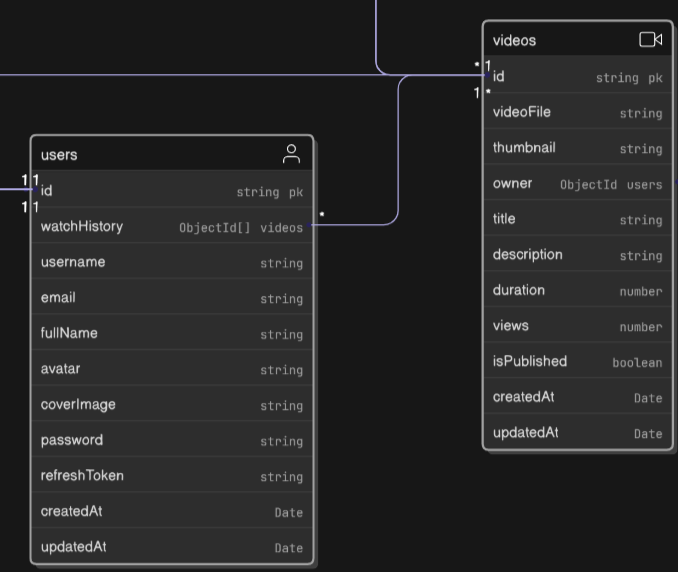

# docs volume 3 

# 1.User and video model 



## User schema 
### Boiler plate code 
```js
import mongoose from "mongoose";
const UserSchema = new mongoose.Schema(
    {

        //    Schema

    },{timestamps: true});

export const User = mongoose.model("User", UserSchema);
```

### Schema :


```js
import mongoose from "mongoose";
const UserSchema = new mongoose.Schema(
    {

        username:{
            type: String,
            required: true,
            unique: true,
            trim: true,
            lowercase: true,
            index: true,
        },
        
        email:{
            type: String,
            required: true,
            unique: true,
            trim: true,
            lowercase: true,
            
        },
        fullname:{
            type: String,
            required: true,
            trim: true,
            index: true,
        },

        awatar:{
            type: String, // cloudinary url 
            required: false,
            
        },
        coverImage:{
            type: String, // cloudinary url
            required: false,
        },
        watchHistory:[
            {
                type: mongoose.Schema.Types.ObjectId,
                ref: "Video"
            },
        
        ],
        password:{
            type: String, 
            required: [true, "Password is required"],
            

        },
        refreshToken:{
            type: String,
        },


    },{timestamps: true});

export const User = mongoose.model("User", UserSchema);
```

## Important :

### bcrypt : A library to help you hash passwords.

Password hashing is a crucial step in securing user passwords in your application. It ensures that even if your database is compromised, the actual passwords are not exposed.

Steps to Implement Password Hashing
Install bcrypt: Open your terminal and run the following command to install bcrypt:

          npm install bcrypt


Hash Passwords: Use bcrypt to hash passwords before storing them in the database.

Compare Passwords: Use bcrypt to compare hashed passwords during login

      
## Pre
Pre middleware functions are executed one after another, when each middleware calls next.

```js
const schema = new Schema({ /* ... */ });
schema.pre('save', function(next) {
  // do stuff
  next();
});
```

```js

           UserSchema.pre("save", async function(next){
            if(this.isModified("password")){
                this.password = await bcrypt.hash(this.password, 10);
                return next();
            }
            return next();

           });

```

```js

           UserSchema.methods.comparePassword = async function(password){
               return await bcrypt.compare(password, this.password);
           };
```


